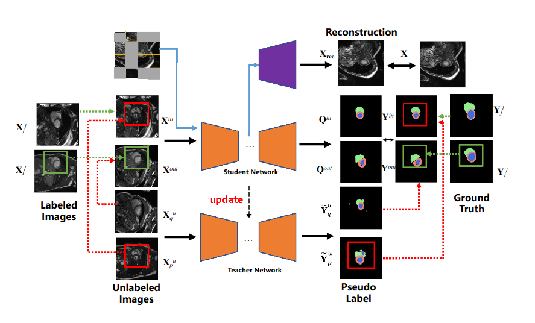
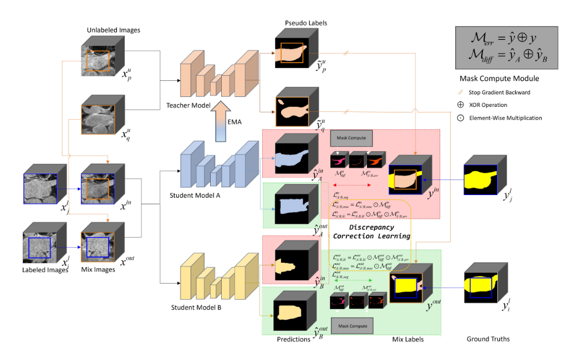
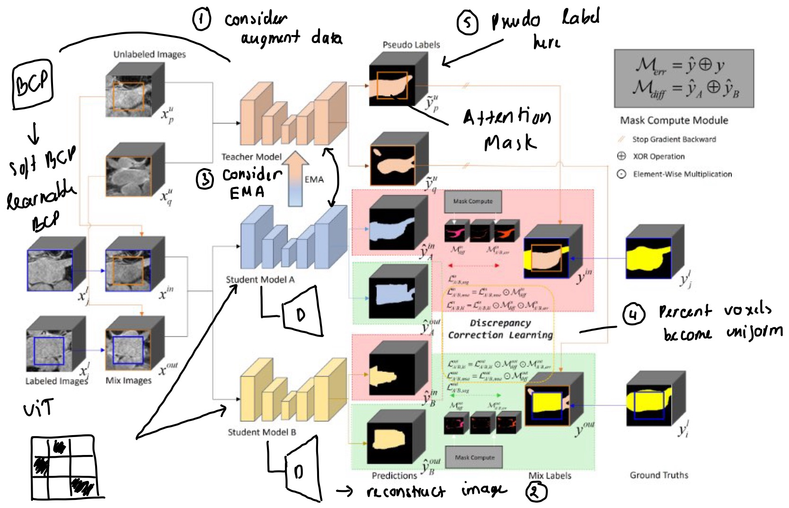

# 🧪 ResearchSS4MIS: Semi-Supervised Learning for Medical Image Segmentation

This repository tracks my research journey in **semi-supervised learning (SSL)** for **medical image segmentation (MIS)**. It begins with **BCP**, extends to a self-built version of **MBCP**, continues to **SDCL**, and culminates in an attempted combination of **MBCP + SDCL** for enhanced performance.

> 🧾 All experiments are based on cardiac MRI segmentation tasks using the ACDC dataset.

---

## 🧠 Research Timeline

### 🔁 1. Bidirectional Copy-Paste (BCP)
- Reimplemented from [BCP CVPR 2023](https://github.com/DeepMed-Lab-ECNU/BCP)
- Used Mean Teacher + BCP consistency with bidirectional augmentation
- Served as baseline for further experiments

### 🔄 2. Masked BCP (MBCP) — *My Own Version*
- Introduced **image reconstruction** to the student network via masked autoencoding
- Separated decoders: one for segmentation, one for reconstruction
- Implemented in `Reconstruction.ipynb`



### 🧠 3. SDCL – Student Discrepancy Correction Learning
- Inspired by *“SDCL: Student Discrepancy-Informed Correction Learning for Semi-Supervised Medical Image Segmentation”* (2024)
- Introduced dual student models with discrepancy-based attention masks
- Reproduced from scratch in `MAE_SDCL/`



### 🧪 4. Combined MBCP + SDCL
- Built an architecture merging:
  - BCP-style dual-view augmentation
  - SDCL-style discrepancy correction
  - MAE-style image reconstruction
- Results were not promising enough, possibly due to loss conflict or reconstruction affecting consistency

---

## 📂 Notebooks

- `Reconstruction.ipynb` – MBCP with MAE-style reconstruction
- `MAE_SDCL/` – Full reimplementation of SDCL pipeline
- `MixMatch.ipynb`, `Visualize.ipynb` – Data visualization and training trials

---

## 🚀 How to Run

### 1. Setup
```bash
pip install -r requirements.txt
